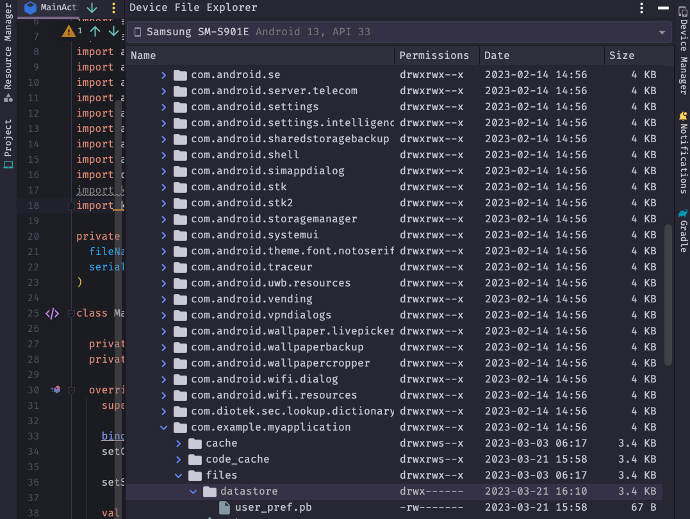
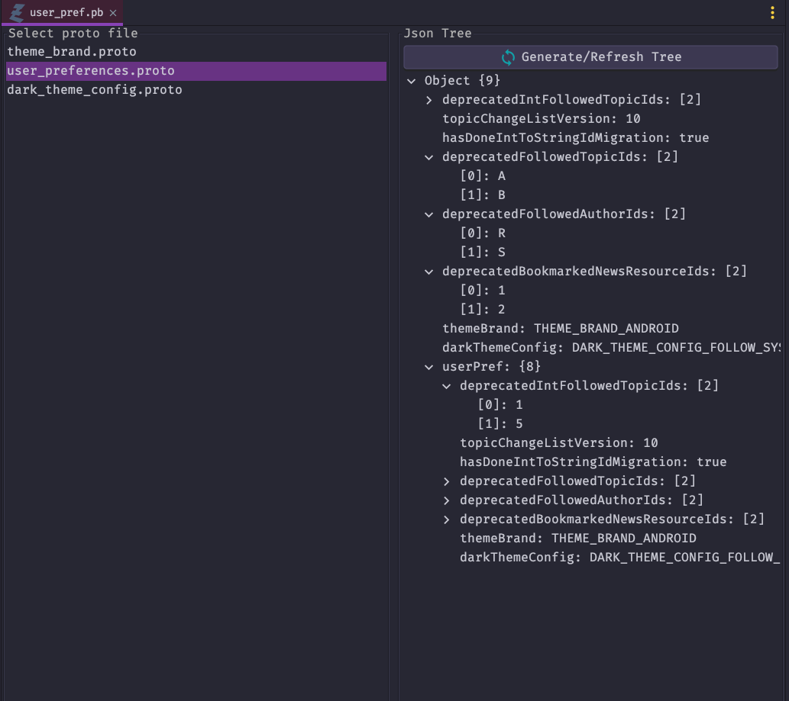
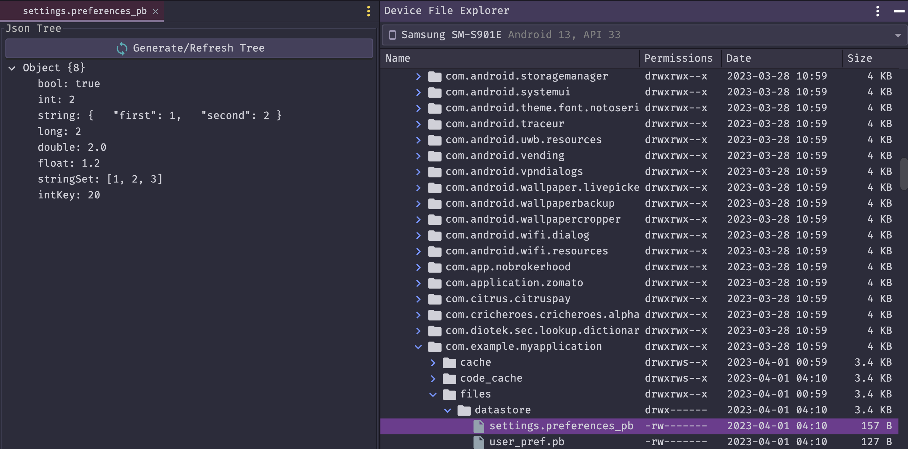

# DataStoreExplorer

<!-- Plugin description -->
A simple proto buff plugin for Android Studio that helps you to view your <em>.pb</em> and <em>.preferences_pb</em> files in json tree format.
<!-- Plugin description end -->

---

## Installation

- Manually

  Download the [latest release](https://github.com/target/DataStoreExplorer/releases/latest) and install it manually using
  <kbd>Settings/Preferences</kbd> > <kbd>Plugins</kbd> > <kbd>⚙️</kbd> > <kbd>Install plugin from disk...</kbd> 

---

## How to use

Proto DataStore
1. Click on <em>.pb</em> file from Android Studio Device explorer
2. Select it's respective <em>.proto</em> file
3. Click on Generate/Refresh Tree

Preference DataStore
1. Click on <em>.preferences_pb</em> file from Android Studio Device explorer
2. Click on Generate/Refresh Tree 

## Examples

Proto DataStore

|  |  |
|---------------------------------------------------|---------------------------------------|

---
Preference DataStore

## License

    Copyright (c) 2023 Target Brands, Inc.

    Licensed under the Apache License, Version 2.0 (the "License");
    you may not use this file except in compliance with the License.
    You may obtain a copy of the License at

       http://www.apache.org/licenses/LICENSE-2.0

    Unless required by applicable law or agreed to in writing, software
    distributed under the License is distributed on an "AS IS" BASIS,
    WITHOUT WARRANTIES OR CONDITIONS OF ANY KIND, either express or implied.
    See the License for the specific language governing permissions and
    limitations under the License.